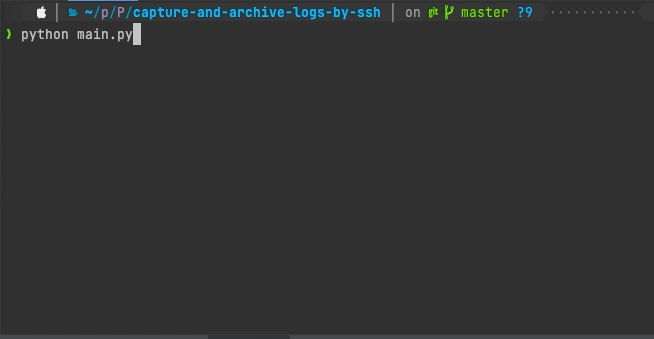

#Monitoring, capture and save logs by ssh.

For use, only adds the data of the connections of the system in the file configs/configs.ini and runs the main.py with python3.

This tool support multiply connections at the same time, only need to add all configs for the connection.o

In the value, Output_rute add the path you want.
In the value "name" add the names of connections you need, separated with a comma, for example (names = QAS,NYVM,LAVM,etc..)

For each connection, you need to add a block of configuration connection with the title that has the same name in the block general.

The data for the connection block is:
- ip
- port
- user
- password
- rute_log (Any text file do you can monitoring).
- days_to_save (This tools auto clean old files, do you can configure the days do you can save)

Example of block of connection:

    [QAS]
    
    ip = 192.168.0.10
    port = 22
    user = testfranevarez
    password = test-password
    rute_log = /var/log/apache2/access.log
    days_to_save = 15

